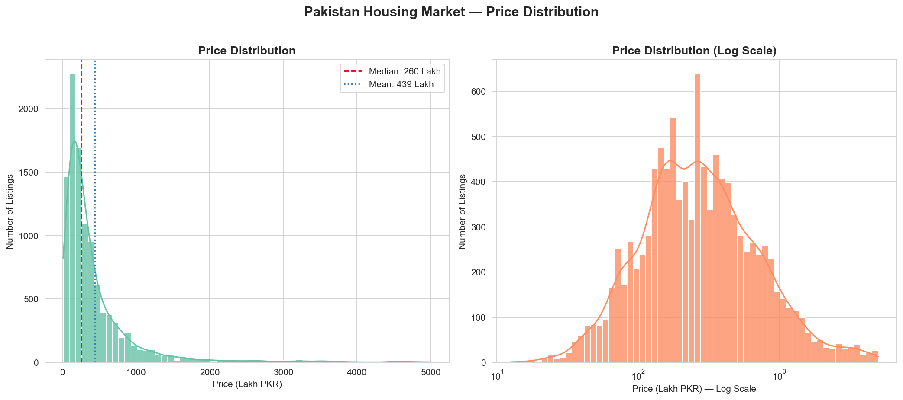
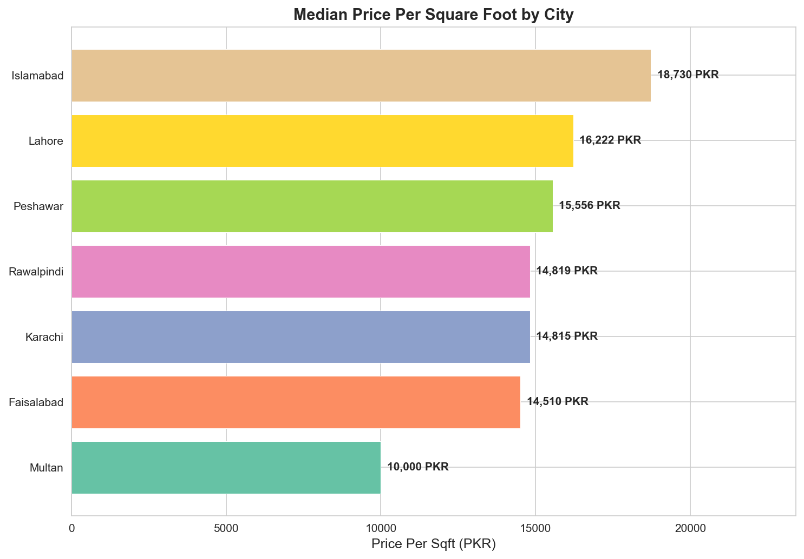
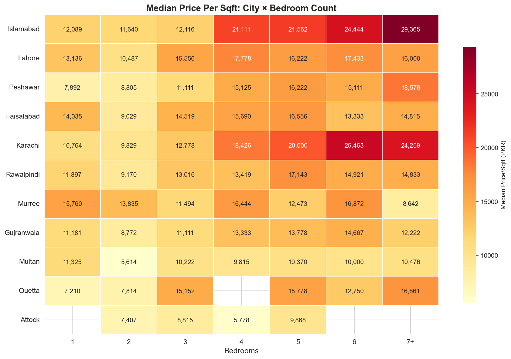

# Pakistan Housing Market — Exploratory Data Analysis

An in-depth analysis of **10,600+ residential property listings** from [Zameen.com](https://www.zameen.com/), Pakistan's largest real estate platform. This project explores pricing patterns, geographic trends, and property characteristics across 11 cities to surface actionable insights for real estate investors and analysts.

## Key Findings

- **Islamabad commands a 2–3x price premium** per sqft over tier-2 cities like Faisalabad and Multan. Sectors F-7, F-8, and E-7 are the most expensive neighborhoods in the country.
- **Location is the #1 price driver** — the same-sized home varies 5–10x in price by neighborhood alone. Bedrooms and bathrooms add little beyond what size already captures.
- **The market is family-home oriented** — 3–5 bedroom properties dominate listings. Studios and 1-beds are nearly absent, reflecting extended-family living norms.
- **Price distribution is heavily right-skewed** — median ~260 Lakh vs. a much higher mean. The bulk of the market sits between 50–500 Lakh; the luxury tail is thin and illiquid.

## Sample Visualizations

### Price Distribution (Log Scale)


### Median Price per Sqft by City


### Price/Sqft Heatmap — City x Bedroom Group


## Tech Stack

- **Python 3.10+**
- pandas, NumPy — data wrangling
- matplotlib, seaborn — visualization
- Jupyter Notebook — interactive analysis

## How to Run

### 1. Clone the repository

```bash
git clone https://github.com/TalhaHamdees/pakistan-housing-eda.git
cd pakistan-housing-eda
```

### 2. Create a virtual environment (recommended)

```bash
python -m venv venv
source venv/bin/activate        # Linux/Mac
venv\Scripts\activate           # Windows
```

### 3. Install dependencies

```bash
pip install -r requirements.txt
```

### 4. Download the dataset

Download the [Zameen.com Housing Prices dataset](https://www.kaggle.com/datasets/huzzefakhan/zameen-property-dataset) from Kaggle and place the CSV file at:

```
data/raw/archive_2/zameen.csv
```

### 5. Launch the notebook

```bash
jupyter notebook notebooks/01_eda_analysis.ipynb
```

Run all cells top-to-bottom (**Kernel → Restart & Run All**). The notebook handles all cleaning, feature engineering, and visualization from the raw CSV.

## Project Structure

```
pakistan-housing-eda/
├── data/
│   ├── raw/                        # Raw CSV from Kaggle (not tracked)
│   └── cleaned_housing_data.csv    # Cleaned dataset (generated by notebook)
├── images/                         # Exported chart PNGs
├── notebooks/
│   └── 01_eda_analysis.ipynb       # Main analysis notebook
├── requirements.txt
└── README.md
```

## Dataset

- **Source:** [Zameen.com Property Dataset (Kaggle)](https://www.kaggle.com/datasets/huzzefakhan/zameen-property-dataset)
- **Format:** Pipe-delimited CSV (`|`)
- **Size:** ~16,000 raw listings → 10,659 after cleaning
- **Features:** city, price, location, bedrooms, bathrooms, area (sqft)
